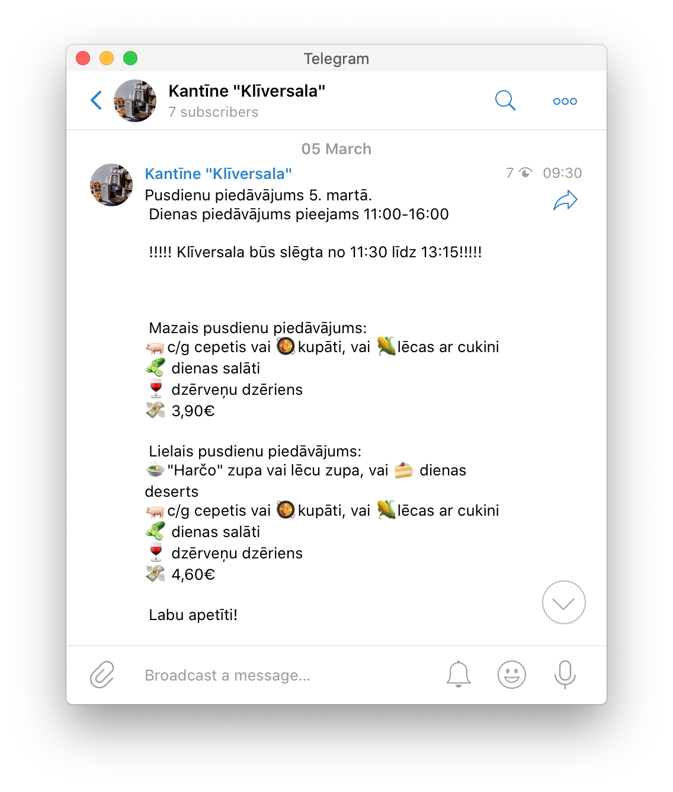

# "Kliversala" Telegram Bot
> Lets you know what's on the lunch menu everyday.

Reads "Kantīne Klīversala" feed containing daily lunch menu and forwards it to a public [telegram channel](https://t.me/kliversala).

  

